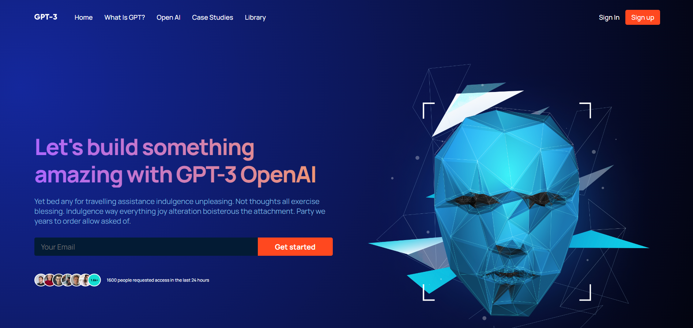
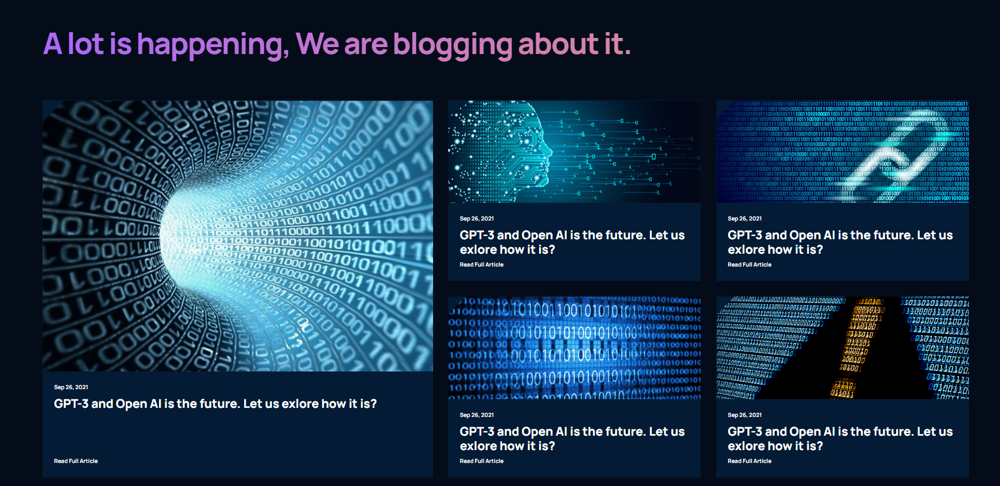
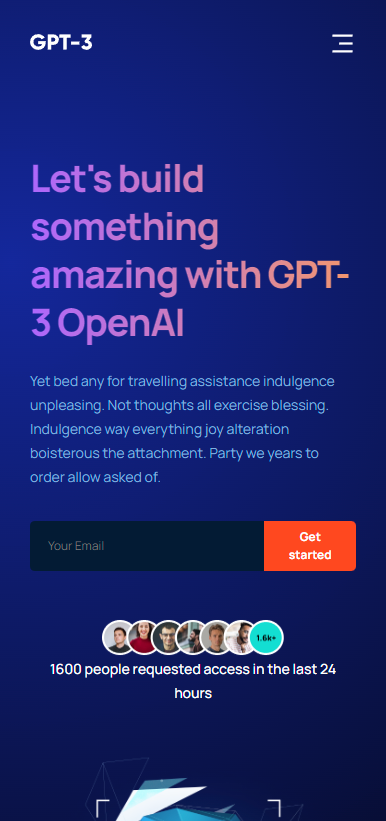

# GPT-3 UI

Training project following a tutorial and [Figma design](https://www.figma.com/file/lz9lLpFHMxHm2odnwM3R0z/gpt3?type=design&node-id=0-15&mode=design&t=yrOSgrl8j6Us5mfy-0). Goal of this project was to hone my CSS and React skills and learn how to take Figma designs and turn them into applications.

## Preview

### Mobile view

